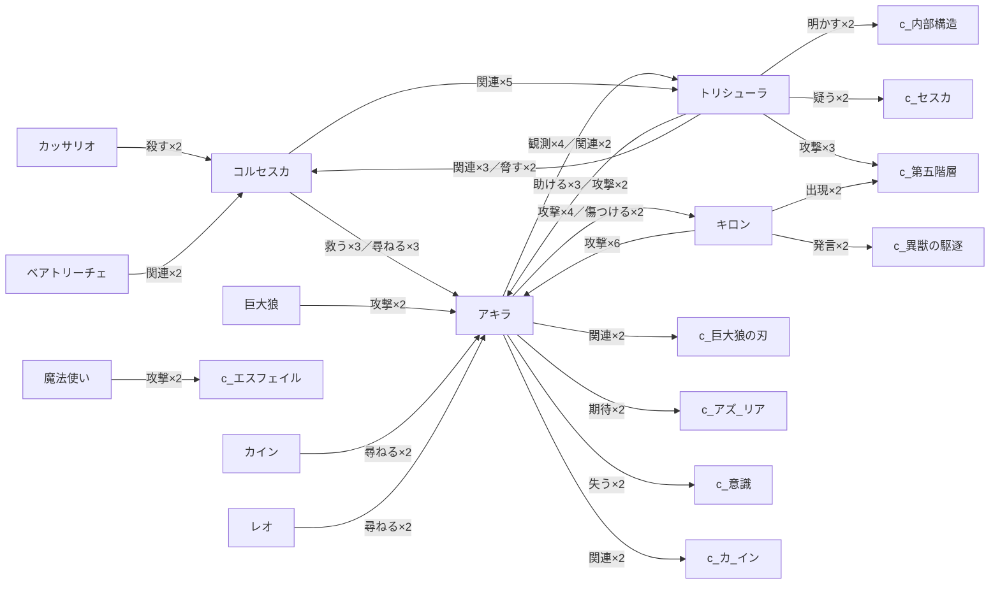

# 関係性マップ

イベント観測（330 三つ組）から、相互に 2 回以上観測されたキャラ間関係を上位 22 件。各キャラページに「関係キャラクター」を注入したため、右サイドの **グラフ** も関係性マップになります（ノードがキャラ、辺が観測された関係）。

## 関係グラフ（観測上位）

> 矢印は観測の方向（主語→目的語）。ラベルは関係の種別×観測回数。

## 上位の関係（観測順）

- [[E_char_コルセスカ|コルセスカ]] → [[E_char_アキラ|アキラ]] — 救う(3)／尋ねる(3)／関連(6)、計 16 観測
- [[E_char_トリシューラ|トリシューラ]] → [[E_char_アキラ|アキラ]] — 助ける(3)／攻撃(2)／関連(4)、計 11 観測
- [[E_char_トリシューラ|トリシューラ]] → [[E_char_コルセスカ|コルセスカ]] — 関連(3)／脅す(2)／攻撃(4)、計 11 観測
- [[E_char_アキラ|アキラ]] → [[E_char_キロン|キロン]] — 攻撃(4)／傷つける(2)／戦闘(3)、計 9 観測
- [[E_char_アキラ|アキラ]] → [[E_char_トリシューラ|トリシューラ]] — 観測(4)／関連(2)／義理を結ぶ(2)、計 8 観測
- [[E_char_キロン|キロン]] → [[E_char_アキラ|アキラ]] — 攻撃(6)、計 6 観測
- [[E_char_コルセスカ|コルセスカ]] → [[E_char_トリシューラ|トリシューラ]] — 関連(5)、計 5 観測
- [[E_char_トリシューラ|トリシューラ]] → [[E_char_第五階層|第五階層]] — 攻撃(3)、計 3 観測
- [[E_char_巨大狼|巨大狼]] → [[E_char_アキラ|アキラ]] — 攻撃(2)、計 2 観測
- [[E_char_アキラ|アキラ]] → [[E_char_巨大狼の刃|巨大狼の刃]] — 関連(2)、計 2 観測
- [[E_char_魔法使い|魔法使い]] → [[E_char_エスフェイル|エスフェイル]] — 攻撃(2)、計 2 観測
- [[E_char_カイン|カイン]] → [[E_char_アキラ|アキラ]] — 尋ねる(2)、計 2 観測
- [[E_char_アキラ|アキラ]] → [[E_char_アズーリア|アズーリア]] — 期待(2)、計 2 観測
- [[E_char_アキラ|アキラ]] → [[E_char_意識|意識]] — 失う(2)、計 2 観測
- [[E_char_トリシューラ|トリシューラ]] → [[E_char_セスカ|セスカ]] — 疑う(2)、計 2 観測
- [[E_char_アキラ|アキラ]] → [[E_char_カーイン|カーイン]] — 関連(2)、計 2 観測
- [[E_char_カッサリオ|カッサリオ]] → [[E_char_コルセスカ|コルセスカ]] — 殺す(2)、計 2 観測
- [[E_char_レオ|レオ]] → [[E_char_アキラ|アキラ]] — 尋ねる(2)、計 2 観測
- [[E_char_キロン|キロン]] → [[E_char_異獣の駆逐|異獣の駆逐]] — 発言(2)、計 2 観測
- [[E_char_トリシューラ|トリシューラ]] → [[E_char_内部構造|内部構造]] — 明かす(2)、計 2 観測
- [[E_char_キロン|キロン]] → [[E_char_第五階層|第五階層]] — 出現(2)、計 2 観測
- [[E_char_ベアトリーチェ|ベアトリーチェ]] → [[E_char_コルセスカ|コルセスカ]] — 関連(2)、計 2 観測
